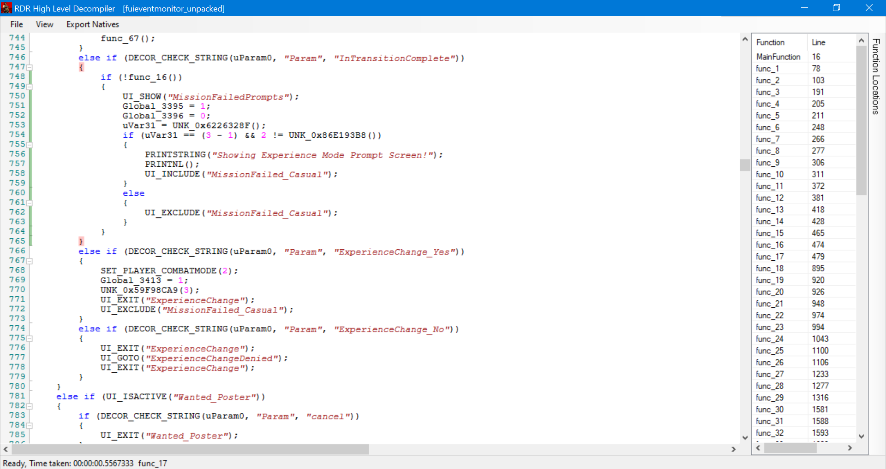

# RDR Script Decompiler
A program that will decompile the script resources (XSC, CSC) files from both X360 and PS3 versions of Red Dead Redemption to High-Level.
SCOs are not supported mainly because they're not used by the game.

You must unpack the scripts with AreDeAre xPlorer to be able to use the decompiler properly (go to Tools/Unpack Resource).
I may update the tool in the future to automatically decompress scripts or even release the source if I ever feel the need to. Main reason I'm not releasing the source at the moment is to make sure people don't try to open and copy/paste functions or crack mod menus, yes this won't let you decompile most of the menus already released (JediJosh Menu, Demonic Menus).

A lot of the code is still broken. It's either opcodes are messed up or Rockstar was smoking something.
Some scripts contains unnecessary branches that doesn't do anything.

Note that the .dll have to be in the same folder as the .exe
Decompiler is based on Zorg93 (NayJames93)'s decompiler made for Grand Theft Auto V.

Credits to Im Foxxyyy (me) and Zorg93 (NayJames93)

